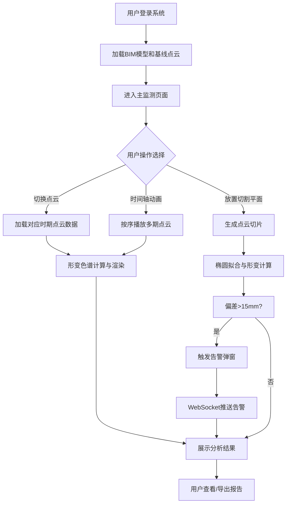

## 1. 产品概述

城市地下综合管廊形变监测3D可视化系统，基于激光雷达点云数据实现管廊结构形变（沉降、收敛）的智能监测与预警。系统面向管廊运维部门，提供BIM模型与多期点云数据的融合展示、横断面切割分析、形变色谱可视化、实时告警推送等核心功能，助力管廊结构安全的精细化管理。

- 核心价值：将海量点云数据转化为直观的形变分析结果，提升管廊运维效率与结构安全预警能力
- 目标用户：城市地下综合管廊运维管理人员、结构工程师、安全监测人员

## 2. 核心功能

### 2.1 用户角色

| 角色 | 注册方式 | 核心权限 |
|------|----------|----------|
| 运维管理员 | 系统账号登录 | 查看3D场景、进行截面分析、配置告警阈值、管理BIM模型和点云数据 |
| 结构工程师 | 系统账号登录 | 查看形变分析报告、导出截面数据、确认告警信息 |
| 访客用户 | 无需登录（演示模式） | 只读浏览3D场景和历史分析结果 |

### 2.2 功能模块

1. **3D场景渲染模块**：加载并渲染管廊BIM模型和多期点云数据，支持旋转、缩放、平移等交互操作
2. **点云数据管理模块**：支持三期点云数据（基线、一期、二期）的加载、切换和可视化
3. **横断面切割模块**：沿管廊轴线任意位置放置切割平面，生成点云切片并拟合椭圆计算形变参数
4. **形变色谱模块**：将点云与基线模型比对，计算偏差值（mm），以色谱渲染直观展示形变分布
5. **时间轴动画模块**：按时间顺序播放多期点云数据，动态展示形变演化过程
6. **告警管理模块**：截面最大偏差超过阈值时弹窗告警，通过WebSocket实时推送告警信息
7. **截面分析面板**：展示截面拟合椭圆参数、收敛值、沉降值、偏差统计等分析结果

### 2.3 页面详情

| 页面名称 | 模块名称 | 功能描述 |
|----------|----------|----------|
| 主监测页面 | 左侧参数面板 | 点云数据切换（基线/一期/二期）、时间轴控制器、告警阈值设置、切割位置调节 |
| 主监测页面 | 中央3D视图 | BIM模型与点云融合渲染、切割平面交互、形变色谱叠加、动画播放 |
| 主监测页面 | 右侧分析面板 | 截面椭圆拟合结果、形变参数（收敛/沉降）、偏差统计图表、告警历史记录 |

## 3. 核心流程

### 3.1 形变监测主流程

用户登录系统后，进入主监测页面。系统自动加载管廊BIM模型和基线点云数据。用户可通过左侧面板切换不同时期的点云数据，或启动时间轴动画查看形变演化。在3D视图中，用户可拖拽切割平面到管廊轴线任意位置，系统实时计算截面切片并拟合椭圆，与基线截面比对得到形变参数。当最大偏差超过15mm阈值时，系统触发告警弹窗并通过WebSocket推送给相关人员。

### 3.2 流程图

## 4. 用户界面设计

### 4.1 设计风格

- **设计定位**：工业科技风，专业、精准、高效的监测系统界面
- **主色调**：深空蓝（#0B1E3F）作为背景主色，营造专业感；科技蓝（#00D4FF）作为主交互色；警示红（#FF4757）、警告黄（#FFA502）、安全绿（#2ED573）构成告警色谱
- **辅助色**：形变热力色谱（蓝→青→绿→黄→红）对应-20mm到+20mm偏差范围
- **字体**：主字体采用 JetBrains Mono（等宽字体，适合数据展示），标题字体采用 Orbitron（科技感显示字体）
- **按钮风格**：扁平直角按钮，带细微科技感边框，hover时发光效果
- **布局风格**：三栏式固定布局，左侧280px参数面板、中央自适应3D视图、右侧320px分析面板
- **图标风格**：线性轮廓图标，统一2px描边，科技感强

### 4.2 页面设计概述

| 页面名称 | 模块名称 | UI元素 |
|----------|----------|--------|
| 主监测页面 | 左侧参数面板 | 分段式卡片布局、数据切换按钮组、时间轴滑块、阈值数字输入框、切割位置调节器、实时状态指示灯 |
| 主监测页面 | 中央3D视图 | 全屏WebGL画布、悬浮操作工具栏（视角复位/测量/截图）、切割平面可交互手柄、色谱图例悬浮层、加载进度指示器 |
| 主监测页面 | 右侧分析面板 | 截面2D视图（椭圆拟合结果）、参数数据卡片网格、偏差统计柱状图、告警列表（带时间戳）、导出按钮 |

### 4.3 响应式设计

- **桌面端优先**：针对2K/4K专业监测大屏优化，最小支持1920×1080分辨率
- **面板可折叠**：左右面板支持折叠收起，最大化3D视图区域
- **触控优化**：3D视图支持触摸屏手势操作（双指缩放、旋转）
- **高DPI适配**：支持2x/3x缩放，确保在高分屏上显示清晰

### 4.4 3D场景设计

- **环境与氛围**：深色宇宙空间背景，带细微星空粒子效果，营造科技沉浸感；管廊内部添加体积光效果模拟照明
- **光照设置**：主光源采用冷白色平行光模拟环境光，添加蓝色点光源增强科技感，点云使用自发光材质确保可见性
- **相机设置**：透视相机，初始视角为管廊45°俯视角度，支持轨道控制器限制俯仰角避免过度翻转
- **交互与动画**：切割平面拖拽时有高亮发光反馈，点云切换时有淡入淡出过渡，时间轴播放时点云数据平滑过渡
- **后期处理**：添加轻微Bloom效果增强科技感，FXAA抗锯齿确保边缘平滑
- **性能预算**：单期点云≤500万点时帧率≥30fps，截面切割响应≤200ms，使用LOD和八叉树空间索引优化性能

### 4.5 视觉细节

- **背景效果**：深空蓝渐变背景，叠加细微网格纹理和扫描线动效
- **面板样式**：半透明玻璃拟态效果（backdrop-filter: blur(12px)），边框1px科技蓝发光
- **数据展示**：关键形变参数采用大号等宽字体，数值变化时有数字滚动动画
- **告警动效**：告警触发时弹窗从右侧滑入，背景红光脉冲闪烁，伴随轻微震动反馈
- **色谱图例**：垂直渐变色条，带刻度标记和数值标签，鼠标悬停显示对应偏差范围
