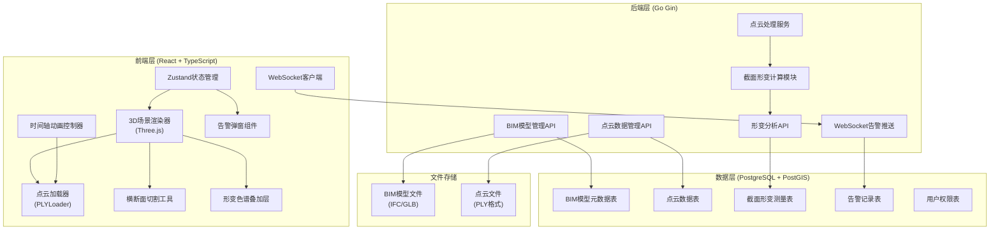
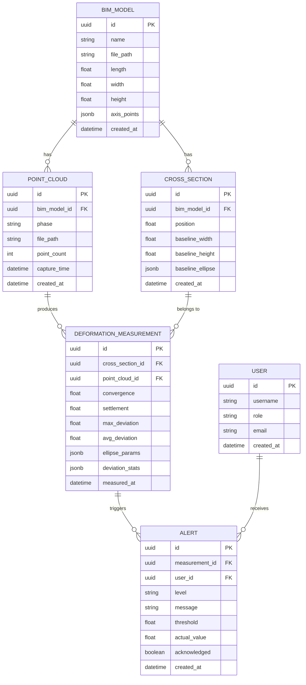
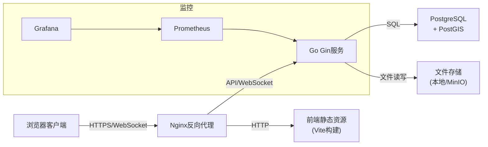

## 1. 架构设计

### 1.1 系统总体架构



## 2. 技术选型说明

### 2.1 前端技术栈

| 技术 | 版本 | 用途说明 |
|------|------|----------|
| React | ^18.2.0 | UI框架，组件化开发 |
| TypeScript | ^5.3.0 | 类型安全，提升代码质量 |
| Vite | ^5.0.0 | 构建工具，快速开发与打包 |
| Three.js | ^0.160.0 | 3D渲染引擎，加载BIM模型和点云 |
| @react-three/fiber | ^8.15.0 | React Three.js集成，声明式3D开发 |
| @react-three/drei | ^9.92.0 | Three.js工具库，提供轨道控制器等 |
| @react-three/postprocessing | ^2.15.0 | 后期处理效果（Bloom、FXAA） |
| Zustand | ^4.4.0 | 轻量级状态管理，管理3D场景状态 |
| TailwindCSS | ^3.4.0 | CSS框架，快速构建UI |
| lucide-react | ^0.294.0 | 图标库 |
| three/addons/loaders/PLYLoader | - | PLY点云文件加载器 |
| Recharts | ^2.10.0 | 图表库，展示形变统计 |

### 2.2 后端技术栈

| 技术 | 版本 | 用途说明 |
|------|------|----------|
| Go | ^1.21.0 | 后端编程语言，高性能并发处理 |
| Gin | ^1.9.0 | Web框架，RESTful API开发 |
| Gorilla WebSocket | ^1.5.0 | WebSocket实时推送 |
| GORM | ^1.26.1 | ORM框架，数据库操作 |
| PostgreSQL | ^16.0 | 关系型数据库，存储形变数据 |
| PostGIS | ^3.4.0 | 空间数据扩展，支持几何计算 |
| go-ply | ^1.0.0 | PLY文件解析库 |

### 2.3 性能优化策略

- **点云渲染优化**：使用八叉树空间索引、LOD层次细节、WebGL Instanced rendering
- **截面切割优化**：预先构建点云空间索引，使用GPU加速的平面裁剪算法
- **数据传输优化**：点云数据采用Draco压缩，分块流式加载
- **状态管理优化**：Zustand选择性订阅，避免不必要的重渲染

## 3. 目录结构定义

### 3.1 前端目录结构

```
frontend/
├── src/
│   ├── components/
│   │   ├── three/
│   │   │   ├── SceneRenderer.tsx      # 3D场景渲染器
│   │   │   ├── PointCloudLoader.tsx   # 点云加载器
│   │   │   ├── CuttingPlane.tsx       # 切割平面组件
│   │   │   ├── CrossSection.tsx       # 截面视图
│   │   │   ├── ChromaLayer.tsx        # 形变色谱层
│   │   │   └── BimModel.tsx           # BIM模型组件
│   │   ├── ui/
│   │   │   ├── ControlPanel.tsx       # 左侧控制面板
│   │   │   ├── AnalysisPanel.tsx      # 右侧分析面板
│   │   │   ├── Timeline.tsx           # 时间轴控制器
│   │   │   ├── AlertModal.tsx         # 告警弹窗
│   │   │   ├── ColorLegend.tsx        # 色谱图例
│   │   │   └── DataCards.tsx          # 数据卡片组件
│   │   └── charts/
│   │       └── DeviationChart.tsx     # 偏差统计图表
│   ├── hooks/
│   │   ├── usePointCloud.ts           # 点云数据管理Hook
│   │   ├── useCrossSection.ts         # 截面分析Hook
│   │   ├── useWebSocket.ts            # WebSocket连接Hook
│   │   └── useAnimation.ts            # 动画控制Hook
│   ├── store/
│   │   └── useSceneStore.ts           # 3D场景状态管理
│   ├── utils/
│   │   ├── pointCloud.ts              # 点云处理工具函数
│   │   ├── geometry.ts                # 几何计算工具（椭圆拟合）
│   │   ├── colormap.ts                # 色映射函数
│   │   └── websocket.ts               # WebSocket工具
│   ├── types/
│   │   ├── index.ts                   # 类型定义
│   │   └── api.ts                     # API类型定义
│   ├── services/
│   │   ├── api.ts                     # API请求封装
│   │   └── mock.ts                    # Mock数据（演示用）
│   ├── pages/
│   │   └── MonitorPage.tsx            # 主监测页面
│   ├── App.tsx
│   └── main.tsx
├── public/
│   └── models/                        # 存放示例BIM模型和点云文件
├── package.json
├── tsconfig.json
├── vite.config.ts
└── tailwind.config.js
```

### 3.2 后端目录结构

```
backend/
├── cmd/
│   └── server/
│       └── main.go                    # 应用入口
├── internal/
│   ├── api/
│   │   ├── handlers/
│   │   │   ├── bim.go                 # BIM模型管理接口
│   │   │   ├── pointcloud.go          # 点云数据管理接口
│   │   │   ├── analysis.go            # 形变分析接口
│   │   │   ├── alert.go               # 告警管理接口
│   │   │   └── websocket.go           # WebSocket接口
│   │   └── router.go                  # 路由定义
│   ├── services/
│   │   ├── pointcloud/                # 点云处理服务
│   │   │   ├── loader.go              # PLY文件加载
│   │   │   ├── processor.go           # 点云数据处理
│   │   │   └── index.go               # 空间索引构建
│   │   ├── analysis/                  # 形变分析服务
│   │   │   ├── cross_section.go       # 截面切割计算
│   │   │   ├── ellipse_fit.go         # 椭圆拟合算法
│   │   │   └── deformation.go         # 形变计算
│   │   ├── alert/                     # 告警服务
│   │   │   ├── detector.go            # 异常检测
│   │   │   └── pusher.go              # WebSocket推送
│   │   └── bim/                       # BIM模型管理服务
│   ├── models/
│   │   ├── bim.go                     # BIM模型数据模型
│   │   ├── pointcloud.go              # 点云数据模型
│   │   ├── deformation.go             # 形变数据模型
│   │   ├── alert.go                   # 告警数据模型
│   │   └── db.go                      # 数据库连接
│   └── config/
│       └── config.go                  # 配置管理
├── pkg/
│   └── ply/                           # PLY文件解析库
├── migrations/
│   └── schema.sql                     # 数据库初始化脚本
├── go.mod
├── go.sum
└── .env.example
```

## 4. 数据模型设计

### 4.1 ER图



### 4.2 数据库Schema (DDL)

```sql
-- 扩展
CREATE EXTENSION IF NOT EXISTS "uuid-ossp";
CREATE EXTENSION IF NOT EXISTS "postgis";

-- BIM模型表
CREATE TABLE bim_models (
    id UUID PRIMARY KEY DEFAULT uuid_generate_v4(),
    name VARCHAR(255) NOT NULL,
    file_path VARCHAR(512) NOT NULL,
    length DECIMAL(10,3) NOT NULL,
    width DECIMAL(10,3) NOT NULL,
    height DECIMAL(10,3) NOT NULL,
    axis_points JSONB NOT NULL,
    created_at TIMESTAMP DEFAULT CURRENT_TIMESTAMP
);

-- 点云数据表
CREATE TABLE point_clouds (
    id UUID PRIMARY KEY DEFAULT uuid_generate_v4(),
    bim_model_id UUID REFERENCES bim_models(id) ON DELETE CASCADE,
    phase VARCHAR(50) NOT NULL,
    file_path VARCHAR(512) NOT NULL,
    point_count INTEGER NOT NULL,
    capture_time TIMESTAMP NOT NULL,
    created_at TIMESTAMP DEFAULT CURRENT_TIMESTAMP,
    UNIQUE(bim_model_id, phase)
);

-- 截面定义表
CREATE TABLE cross_sections (
    id UUID PRIMARY KEY DEFAULT uuid_generate_v4(),
    bim_model_id UUID REFERENCES bim_models(id) ON DELETE CASCADE,
    position DECIMAL(10,3) NOT NULL,
    baseline_width DECIMAL(10,3) NOT NULL,
    baseline_height DECIMAL(10,3) NOT NULL,
    baseline_ellipse JSONB NOT NULL,
    created_at TIMESTAMP DEFAULT CURRENT_TIMESTAMP,
    UNIQUE(bim_model_id, position)
);

-- 形变测量表
CREATE TABLE deformation_measurements (
    id UUID PRIMARY KEY DEFAULT uuid_generate_v4(),
    cross_section_id UUID REFERENCES cross_sections(id) ON DELETE CASCADE,
    point_cloud_id UUID REFERENCES point_clouds(id) ON DELETE CASCADE,
    convergence DECIMAL(10,3) NOT NULL,
    settlement DECIMAL(10,3) NOT NULL,
    max_deviation DECIMAL(10,3) NOT NULL,
    avg_deviation DECIMAL(10,3) NOT NULL,
    ellipse_params JSONB NOT NULL,
    deviation_stats JSONB NOT NULL,
    measured_at TIMESTAMP DEFAULT CURRENT_TIMESTAMP,
    UNIQUE(cross_section_id, point_cloud_id)
);

-- 告警记录表
CREATE TABLE alerts (
    id UUID PRIMARY KEY DEFAULT uuid_generate_v4(),
    measurement_id UUID REFERENCES deformation_measurements(id) ON DELETE CASCADE,
    user_id UUID,
    level VARCHAR(20) NOT NULL,
    message TEXT NOT NULL,
    threshold DECIMAL(10,3) NOT NULL,
    actual_value DECIMAL(10,3) NOT NULL,
    acknowledged BOOLEAN DEFAULT FALSE,
    acknowledged_at TIMESTAMP,
    created_at TIMESTAMP DEFAULT CURRENT_TIMESTAMP
);

-- 用户表
CREATE TABLE users (
    id UUID PRIMARY KEY DEFAULT uuid_generate_v4(),
    username VARCHAR(50) UNIQUE NOT NULL,
    role VARCHAR(20) NOT NULL,
    email VARCHAR(255),
    password_hash VARCHAR(255) NOT NULL,
    created_at TIMESTAMP DEFAULT CURRENT_TIMESTAMP
);

-- 索引
CREATE INDEX idx_point_clouds_bim_model ON point_clouds(bim_model_id);
CREATE INDEX idx_cross_sections_bim_model ON cross_sections(bim_model_id);
CREATE INDEX idx_measurements_cross_section ON deformation_measurements(cross_section_id);
CREATE INDEX idx_measurements_point_cloud ON deformation_measurements(point_cloud_id);
CREATE INDEX idx_alerts_measurement ON alerts(measurement_id);
CREATE INDEX idx_alerts_created ON alerts(created_at DESC);
```

## 5. API接口定义

### 5.1 RESTful API

```typescript
// 类型定义
interface BIMModel {
  id: string;
  name: string;
  file_path: string;
  length: number;
  width: number;
  height: number;
  axis_points: { x: number; y: number; z: number }[];
  created_at: string;
}

interface PointCloud {
  id: string;
  bim_model_id: string;
  phase: 'baseline' | 'phase1' | 'phase2';
  file_path: string;
  point_count: number;
  capture_time: string;
  created_at: string;
}

interface CrossSection {
  id: string;
  bim_model_id: string;
  position: number;
  baseline_width: number;
  baseline_height: number;
  baseline_ellipse: EllipseParams;
  created_at: string;
}

interface EllipseParams {
  cx: number;
  cy: number;
  a: number;
  b: number;
  rotation: number;
}

interface DeformationMeasurement {
  id: string;
  cross_section_id: string;
  point_cloud_id: string;
  convergence: number;
  settlement: number;
  max_deviation: number;
  avg_deviation: number;
  ellipse_params: EllipseParams;
  deviation_stats: {
    min: number;
    max: number;
    mean: number;
    std: number;
    histogram: number[];
  };
  measured_at: string;
}

interface Alert {
  id: string;
  measurement_id: string;
  level: 'warning' | 'danger';
  message: string;
  threshold: number;
  actual_value: number;
  acknowledged: boolean;
  created_at: string;
}

// API接口
interface ApiEndpoints {
  // BIM模型管理
  'GET /api/bim-models': { response: BIMModel[] };
  'GET /api/bim-models/:id': { response: BIMModel };
  'POST /api/bim-models': { body: Omit<BIMModel, 'id' | 'created_at'>; response: BIMModel };
  'PUT /api/bim-models/:id': { body: Partial<BIMModel>; response: BIMModel };
  'DELETE /api/bim-models/:id': { response: { success: boolean } };

  // 点云数据管理
  'GET /api/point-clouds': { params: { bim_model_id?: string }; response: PointCloud[] };
  'GET /api/point-clouds/:id': { response: PointCloud };
  'GET /api/point-clouds/:id/download': { response: Blob };
  'POST /api/point-clouds/upload': { body: FormData; response: PointCloud };
  'DELETE /api/point-clouds/:id': { response: { success: boolean } };

  // 截面管理
  'GET /api/cross-sections': { params: { bim_model_id?: string }; response: CrossSection[] };
  'POST /api/cross-sections': { body: Omit<CrossSection, 'id' | 'created_at'>; response: CrossSection };
  'DELETE /api/cross-sections/:id': { response: { success: boolean } };

  // 形变分析
  'POST /api/analysis/cross-section': {
    body: {
      cross_section_id: string;
      point_cloud_id: string;
      position: number;
    };
    response: DeformationMeasurement;
  };
  'GET /api/analysis/measurements': {
    params: { cross_section_id?: string; point_cloud_id?: string };
    response: DeformationMeasurement[];
  };

  // 告警管理
  'GET /api/alerts': { params: { acknowledged?: boolean }; response: Alert[] };
  'PUT /api/alerts/:id/acknowledge': { response: Alert };
}
```

### 5.2 WebSocket消息协议

```typescript
// 消息类型定义
interface WebSocketMessage {
  type: 'alert' | 'status' | 'ping';
  payload: AlertMessage | StatusMessage | PingMessage;
  timestamp: number;
}

interface AlertMessage {
  alert_id: string;
  measurement_id: string;
  level: 'warning' | 'danger';
  message: string;
  threshold: number;
  actual_value: number;
  cross_section_position: number;
  point_cloud_phase: string;
}

interface StatusMessage {
  status: 'processing' | 'completed' | 'error';
  task_id: string;
  progress: number;
  message: string;
}

interface PingMessage {
  timestamp: number;
}
```

## 6. 核心算法说明

### 6.1 截面切割算法

```
算法：平面切割点云获取截面切片
输入：点云数据P(N×3)，切割平面平面方程ax+by+cz+d=0，厚度阈值ε
输出：截面点云S(M×3)，M≤N

1. 对每个点p_i ∈ P：
   2. 计算点到平面距离 d_i = |a*x_i + b*y_i + c*z_i + d| / sqrt(a²+b²+c²)
   3. 如果 d_i ≤ ε，将p_i加入S
4. 将S投影到切割平面上，得到2D坐标
5. 返回S和投影坐标
```

### 6.2 椭圆拟合算法（最小二乘法）

```
算法：基于最小二乘法的椭圆拟合
输入：2D点集S={(x_i,y_i)}，i=1..n
输出：椭圆参数 {cx, cy, a, b, θ}

椭圆一般方程：Ax² + Bxy + Cy² + Dx + Ey + F = 0，约束4AC - B² = 1

1. 构建设计矩阵D和约束矩阵C
2. 求解广义特征值问题 D^T D * u = λ * C * u
3. 取最小正特征值对应的特征向量作为参数
4. 转换为标准椭圆参数：
   - 中心 (cx, cy)
   - 半长轴a，半短轴b
   - 旋转角θ
```

### 6.3 点云偏差计算

```
算法：点云与基线模型偏差计算
输入：目标点云P_t，基线截面参数E_b(椭圆)
输出：每个点的偏差值d_i（mm）

1. 对每个点p_i ∈ P_t：
   2. 投影到截面平面得到(x_i, y_i)
   3. 计算到椭圆E_b的最短距离d_i：
      - 数值求解法向投影点
      - d_i = 距离 × 符号（内负外正）
   4. 将d_i转换为mm单位
5. 生成色映射颜色c_i = colormap(d_i, range=[-20, 20])
6. 返回偏差数组D和颜色数组C
```

## 7. 部署架构


